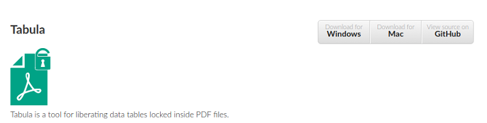
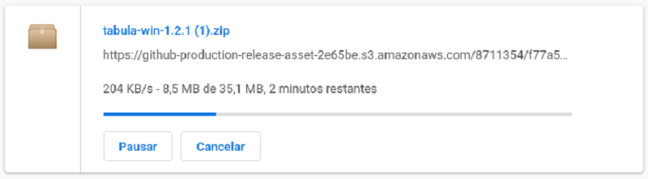
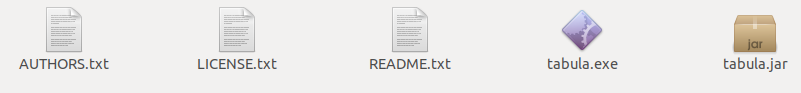
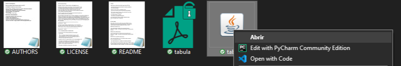
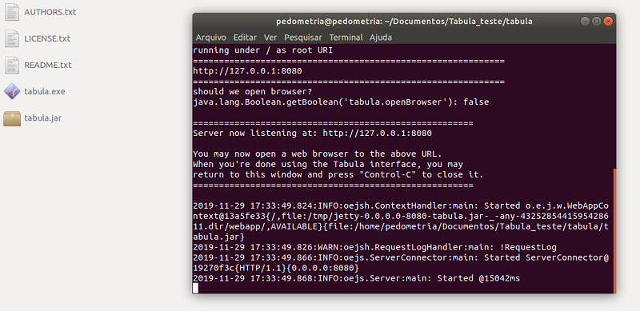
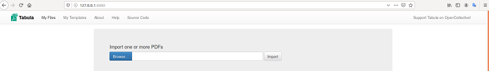

Você já deve estar sabendo que o FEBR elegeu o Tabula como ferramenta de extração de dados do solo de arquivos no formato PDF. Se não sabe, então leia nossa [matéria][materia] anterior sobre o uso do Tabula. Nesta matéria você vai saber mais sobre como descarregar e executar o Tábula nos sistemas operacional [Ubuntu 18.04.3 LTS][ubuntu] e [Windows 10][Windows].

[materia]: http://coral.ufsm.br/febr/blog/2019/12/02/extracao-de-dados-de-documentos-pdf/
[ubuntu]: https://ubuntu.com/
[Windows]:https://www.microsoft.com/pt-br/windows/

Para usar o Tabula no seu sistema operacional, você deverá ter instalado em seu computador os seguintes softwares:

1. [Java][java], linguagem de programação com a qual o Tabula foi construído;
2. Um editor de planilhas eletrônicas como o [LibreOffice][libreoffice];
3. Um descompactador de arquivos como o [7zip][7zip]; 

[java]: https://www.java.com/pt_BR/download/
[libreoffice]: https://www.libreoffice.org/
[7zip]: https://www.7-zip.org/

__1° Passo__:Faça o download do programa no site oficial do Tabula <https://tabula.technology/>. Após concluir download temos um arquivo como mostra a seguir:

__2° Passo__: Descompactar o arquivo Zip na pasta ~/home/user/Documents,  ou outro pasta sua escolha. 

__3° Passo__:Após descompactar os arquivos como mostra a figura 4, observamos que temos  5 arquivos dentro da pasta Tabula. 

###Importante: Sistema Linux pula para 5° Passo, caso for Windons segue 4° passo.

__4° Passo__: Para inicializar o Tabula no Windons, click duas vezes em cima do arquivo Tabula.jar, como mostra figura abaixo.

Em seguida, abra o navegador de sua preferência e vá até  o endereço local `http://127.0.0.1:8080/`.

__5° Passo__: Para inicializar o Tabula no Linux, vamos abrir uma janela do terminal, na pasta se encontra os arquivos. Digitar o comando :
ˋˋˋjava -Dfile.encoding=utf-8 -Xms256M -Xmx1024M -jar tabula.jarˋˋˋ

Em seguida, abra o navegador de sua preferência e vá até  o endereço local `http://127.0.0.1:8080/`.

_Nota: Para saber mais sobre ultlização do Tabula acesse nosso [artigo][artigo].
[artigo]: http://coral.ufsm.br/febr/blog/2019/12/02/extracao-de-dados-de-documentos-pdf/

