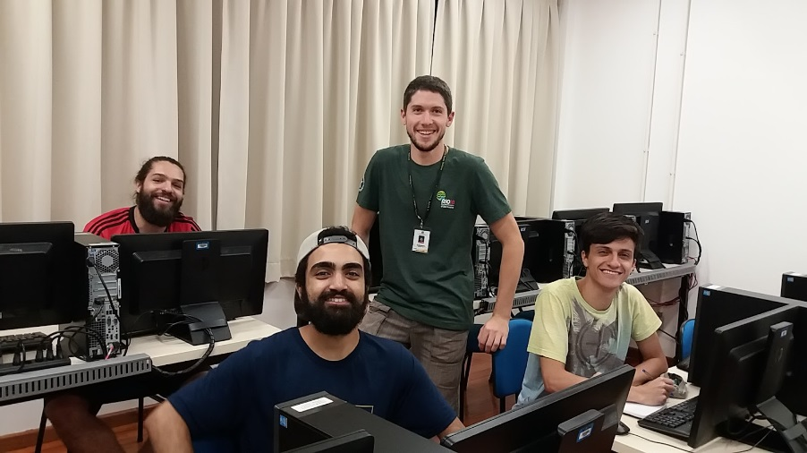

O Brasil acabou de sediar o *21st World Congress of Soil Science* ([21WCSS][wcss]), realizado na cidade do Rio de Janeiro. Durante o evento, a comunidade internacional de cientistas do solo conheceu o Repositório Brasileiro Livre para Dados Abertos do Solo, ___febr___, o resultado da colaboração de 54 pesquisadores, a maioria deles brasileiros. Agora, passadas algumas semanas, a equipe do ___febr___ ganha três novos membros. Vamos conhecer um pouco sobre cada um eles?

[wcss]: https://www.21wcss.org/

O primeiro deles é Matheus Ferreira Ramos ([Lattes][lattesMatheus]), aluno do curso de Bacharelado em Ciência da Computação da ([UTFPR-SH][utfprsh]). Matheus atua na área de extensão no ___febr___, recebendo bolsa do Programa Institucional de Apoio à Inclusão Social, Pesquisa e Extensão Universitária ([PIBIS][pibis]) da Fundação Araucária de Apoio ao Desenvolvimento Científico e Tecnológico do Paraná ([FA][fa]). Dentre as tarefas descritas em seu ([plano de trabalho][planoMatheus]) estão o suporte aos colaboradores de instituições parceira, a divulgação e popularização do ___febr___, o desenvolvimento de funcionalidades de facilitação de acesso, e a condução de atividades educativas com a comunidade de Santa Helena e região.

[fa]: http://www.fappr.pr.gov.br/
[pibis]: http://www.fappr.pr.gov.br/arquivos/File/chamadas2018/2018_CP03_Pibis.pdf
[planoMatheus]: https://docs.google.com/document/d/1xkjNqejZtoBl9P4UhHWb_OBceVY2fo6ovgpgbdAtr7I/edit?usp=sharing
[utfprsh]: http://portal.utfpr.edu.br/
[lattesMatheus]: http://lattes.cnpq.br/1502739519386205

O segundo membro é Mikael Messias ([Lattes][lattesMikael]), também aluno da UTFPR-SH no curso Bacharelado em Ciência da Computação. Mikael atua na área de pesquisa no ___febr___, com bolsa do Programa de Bolsas de Iniciação Científica ([PIBIC][pibic]) financiada pela Fundação Araucária. No febr, Mikael é responsável pela revisão e avaliação da qualidade dos dados do solo da região Sul do Brasil - com ênfase no estado do Paraná - já publicados no ___febr___. Seu ([plano de trabalho][planoMika]) inclui ainda a compilação de novos conjuntos de dados para preenchimento das áreas com poucos dados.

[lattesMikael]: http://lattes.cnpq.br/4784406446479043
[pibic]: http://www.fappr.pr.gov.br/arquivos/File/chamadas2018/2018_CP02_PibicPibit.pdf
[planoMika]: https://docs.google.com/document/d/1TvRbCYK7pPvBllimMiSzuBWPvRX0wTryg-gq0Rcm8bg/edit?usp=sharing

Finalmente, o terceiro mais novo membro da equipe do ___febr___, Rander Carneiro ([Lattes][lattesRander]), trabalha com os conjuntos de dados da região Sudeste do Brasil. ([Seu plano de trabalho][planoRander]) inclui, além da revisão e avaliação de qualidade dos dados do solo, a recuperação de coordenadas espaciais para uso dos dados do ___febr___ em projetos de mapeamento digital do solo. Assim como Matheus e Mikael, Rander é   discente do curso Bacharelado em Ciência da Computação da UTFPR-SH, atuando como voluntário no Programa Institucional em Iniciação Científica e Tecnológica ([PIVICT][pivict]).

[lattesRander]: http://lattes.cnpq.br/9844984024940216
[planoRander]: https://docs.google.com/document/d/1sxRSJkP1z1jNWVfeBNz79X15mSEfO9j07m-l26aWh18/edit?usp=sharing
[pivict]: http://portal.utfpr.edu.br/editais/pesquisa-e-pos-graduacao/reitoria/programa-institucional-de-voluntariado-em-iniciacao-cientifica-e-tecnologica

Com a entrada desses três novos membros na equipe, os dados do repositório passarão por uma ampla revisão e verificação de consistência. Isso trará mais qualidade e confiança para o ___febr___. O compartilhamento imediato desses dados revisados alavancará novas pesquisas em ciência do solo. Permitirá também otimizar o uso dos recursos públicos, principalmente pela eliminação de esforços duplicados de compilação e revisão de dados.

E pra você, aluna dos cursos de Biologia ou Agronomia da UTFPR-SH, que só ficou sabendo do ___febr___ agora, ou que já o conhecia, e quer fazer parte da nossa equipe, mas não sabe como, nós temos uma dica pra você! Envie-nos uma mensagem de ([e-mail][email]) com o assunto "novo membro" e nos diga-nos porque quer trabalhar no ___febr___. Neste mês de outubro de 2018 nós selecionaremos duas novas integrantes para nosso time.

[email]: http://coral.ufsm.br/febr/contact/

